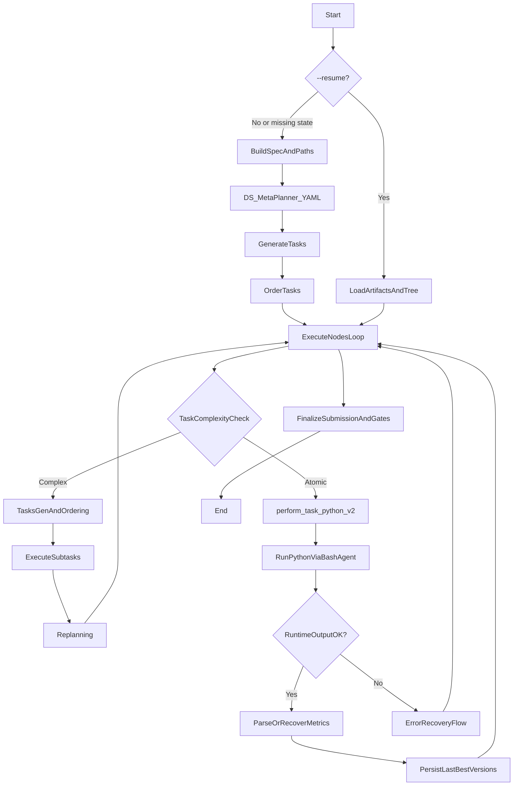
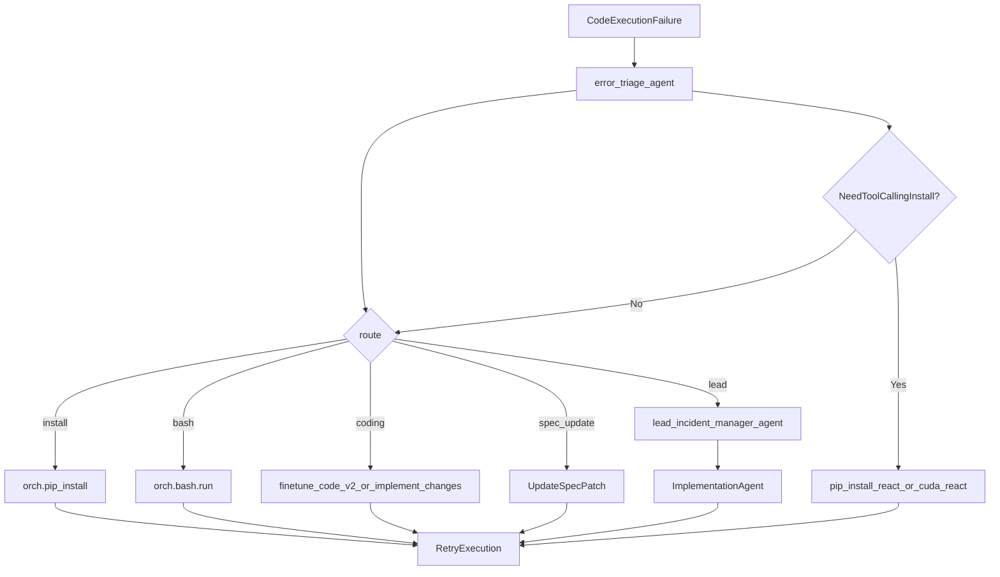

# LinguaInterpreter Agent Interactions Documentation

## Overview
LinguaInterpreter uses a multi-agent system where specialized agents collaborate to execute machine learning workflows. Each agent has specific responsibilities and communicates through standardized interfaces.

## Core Agents

### 1. Meta-Planner Agent
**Purpose**: Creates high-level project skeleton and task breakdown
**Trigger**: At the beginning of a new project
**Input**:
- Main task description
- Technical specification (spec.json)

**Output**:
- High-level task plan (YAML list of stages, capped by `MAX_STAGES` in the planner call)
- Time budget allocations per stage

**Template Example**:
```yaml
tasks:
  - task: "1. Initial Data Analysis (EDA)"
    time_budget_sec: 1800
  - task: "2. Feature Engineering & Preprocessing" 
    time_budget_sec: 2400
```

**Important**:
- The meta-plan must be **competition-realistic** (includes hidden stages like adversarial validation / leakage detection / error analysis).
- Concrete implementation details are intentionally deferred to deeper levels; the meta-plan is a scaffold.

---

### 2. Task Complexity Checker
**Purpose**: Determines if a task should be broken into subtasks
**Trigger**: Before executing each main task
**Input**:
- Task description
- Main task context
- Previous answers/history

**Output**:
- Boolean: "true" (complex, needs subtasks) or "false" (simple, execute directly)

---

### 3. Code Generator Agent
**Purpose**: Generates executable Python code for specific tasks
**Trigger**: When executing simple tasks directly
**Input**:
- Specific sub-task description
- Technical specification
- Previous code (if available)
- Context/time constraints

**Output**:
- Executable Python code

**Key Directives**:
- Generate SINGLE, EXECUTABLE Python script
- Strictly adhere to current sub-task scope
- Load spec dynamically: `spec = json.load(open(os.path.join(project_root, 'artifacts/spec.json')))`
- Print debug stats: `print(f"DEBUG: Data Shape: {df.shape}")`
- Leverage available tools (like read-only filesystem checkers and **`generate_and_execute`** for fast snippet testing) to validate assumptions during the planner/reviewer phases.

---

### 4. Task Orderer Agent
**Purpose**: Orders subtasks logically for complex workflows
**Trigger**: When a task is determined to be complex
**Input**:
- Main task description
- List of generated subtasks
- Technical specification

**Output**:
- Ordered YAML list of subtasks with time budgets

---

### 5. Code Executor & Verifier
**Purpose**: Runs generated code and verifies results
**Trigger**: After code generation
**Process**:
1. **Safety Check**: Audits code for violations
2. **Execution**: Runs the code with timeout
3. **Result Analysis**: Evaluates stdout/stderr for success
4. **Metric extraction**: Parses `METRICS_JSON` from stdout (`src/validators.py` — brace-balanced JSON, **last valid** block wins if multiple prints)
5. **LLM recovery (optional)**: If parsing yields nothing but logs look like training/eval, **`metrics_recover_from_stdout`** (`llm_fast`, stdout **tail** ~14k chars) proposes JSON; **`validate_recovered_metrics`** enforces `primary` / `name` / `maximize` vs `spec`
6. **Verification script**: If metrics still missing, **`verification_code_gen`** + execute `metric_check.py`
7. **Final verifier (best-effort)**: At process shutdown (`main.py` `finally`), run `checker_code_agent` to generate a lightweight QA script and execute it; store raw output in `artifacts/final/final_verifier_stdout.txt`.
8. **Persistence**: Valid **`type: calculated`** metrics → **`_update_best_from_candidate`** → `artifacts/last/metrics.json`, `artifacts/versions/<ts>_<tag>/metrics.json`, **`artifacts/versions/ledger.csv`** + `index.json` (canonical keys: `type`, `primary`, `name`, `maximize`, optional `extras` — see `docs/08_SPECIFICATIONS_AND_INTERFACES.md`)

**Planner & code context** (`src/pipeline.py`): **`format_spec_constraints_block(spec)`** (`src/utils.py`) is prepended to **meta-planner**, **task decomposition**, **task ordering** (including Improve-mode ordering), and **code generation** — same flags (internet / pretrained / external data + short note that build-time packages may exist). The code path also gets an **artifacts snapshot** (checkpoints + metric file hints) for reuse.

In Improve-mode, when the runtime needs to generate (or refresh) improvement tasks, it first uses `react_improver_meta_planner_agent` (ReAct meta-planner with `bash_exec` + `python_exec`) to audit the current baseline and discover where metrics were computed in `artifacts/versions/*` + the producing `code.py`, then outputs a hierarchical deep task list. This step is skipped on `--resume` when children/tasks already exist.

**Key Components**:
- **Router**: Routes failures to appropriate recovery actions
- **Lead Agent**: Provides high-level debugging suggestions
- **Implementation Agent**: Fixes code based on suggestions

---

### 6. Error Router Agent
**Purpose**: Classifies execution failures and determines next action
**Trigger**: When code execution fails
**Input**:
- Error messages (stderr)
- Standard output (stdout)
- Technical specification
- Generated code

**Output**:
```json
{
  "route": "install|coding|bash|lead|spec_update",
  "packages": ["package_name"],
  "reason": "explanation"
}
```

**Routes**:
- `install`: Missing Python packages
- `coding`: Code logic errors
- `bash`: System/shell issues
- `lead`: Complex problems needing high-level analysis
- `spec_update`: Specification needs updating

**Implementation** (`src/router.py`, class `ErrorRouter`):
- First calls **`error_triage_agent`** (`src/prompts_agents.py`) for a JSON plan.
- When hints are needed (empty `packages` on `install`, `ModuleNotFoundError`, repeated failures), runs **`pip_install_react`**: a **ReAct loop** via **`invoke_with_tools`** + **`StructuredTool`** (no LangGraph). The orchestrator **`orch`** is passed into `ErrorRouter` so tools are real, not hypothetical.

**Tools available to `pip_install_react`**:
| Tool | Effect |
|------|--------|
| `pip_install` | Runs **`GlobalOrchestrator.pip_install()`** in the project venv (`packages` string + optional `pip_extra`, e.g. `--index-url` for CUDA wheels). |
| `cuda_probe` | Runs embedded **`CUDA_PROBE_PY`** via `run_python_code` — same venv as training — and prints `BOOTSTRAP_CUDA_PROBE_JSON`. |
| `google_search` | Optional; only if `GOOGLE_API_KEY` and `GOOGLE_CSE_ID` are set (Programmable Search). |

The system prompt tells the model to use **`cuda_probe`** when logs show CPU training while **`spec.hardware`** indicates a GPU, then **`pip_install`** for torch/CUDA if needed.

**Logs**: `{artifacts_dir}/agents/pip_install_react.jsonl` (and token usage via `invoke_with_tools`).

---

### 6b. Bootstrap CUDA repair ReAct
**Purpose**: After preinstall, if PyTorch still reports `cuda_available: false` in the venv while you configured CUDA wheels, attempt an LLM-driven reinstall before training starts.

**Trigger**: `bootstrap_gpu_stack(..., llm_fast=...)` on a **fresh spec pipeline** (`src/pipeline.py` passes `llm_fast`); not available in the very early `main.py` bootstrap (runs before LLMs load).

**Implementation**: **`repair_torch_cuda_with_react`** in `src/router.py` — same tool pattern (`pip_install`, `cuda_probe`), focused on `preinstall.torch_cuda_index_url` and torch-family packages. Success is verified by a **real** second `cuda_probe`, not only by model JSON.

**Logs**: `{artifacts_dir}/agents/bootstrap_cuda_react.jsonl` (via `log_agent_trace` / `invoke_with_tools`).

---

### 7. Lead Agent (Tech Lead)
**Purpose**: Provides high-level problem analysis and solutions
**Trigger**: When router directs to "lead" route
**Input**:
- Lead reason (from router)
- Task description
- Current code
- Execution output

**Output**:
- Problem analysis
- Concrete, actionable changes

---

### 8. Implementation Agent
**Purpose**: Rewrites code based on lead agent suggestions
**Trigger**: After lead agent provides suggestions
**Input**:
- Lead agent suggestions
- Original code
- Task description
- Technical specification

**Output**:
- Corrected, complete Python code

---

### 9. Verification Code Generator
**Purpose**: Creates code to validate task results
**Trigger**: When **`METRICS_JSON`** is still missing after regex parse and optional **`metrics_recover_from_stdout`** (LLM on stdout tail)
**Input**:
- Technical specification
- Context about what was executed
- Previous code

**Output**:
- Verification Python script that calculates metrics and prints the same **canonical** `METRICS_JSON` (`type`, `primary`, `name`, `maximize`, optional `extras`)

---

### 10. Replanning Agent
**Purpose**: Dynamically adjusts task plan based on execution
**Trigger**: Between task executions
**Input**:
- Original goal
- Completed tasks summary
- Remaining tasks
- Time budget

**Output**:
- Updated task plan (JSON)

---

### 11. Aggregate Answers Agent
**Purpose**: Combines multiple agent responses into coherent summary and feeds the global plan
**Trigger**: After task completion (typically at root/main level)
**Input**:
- Multiple agent responses
- Task requirements
- Technical specification

**Output**:
- Structured summary report that is:
  - Printed to stdout for the user, and
  - Saved into `ml_project/artifacts/aggregate_summary.md` (relative to project root) and embedded into `task_plan.md` under **\"Current Direction & Next Steps\"**, so other agents can read a single consolidated context artifact.

---

### 12. Answer Checker Agent
**Purpose**: Verifies if aggregated answer meets requirements
**Trigger**: After answer aggregation
**Input**:
- Task requirements
- Aggregated answer
- Check criteria
- Technical specification

**Output**:
- Boolean: True/False

---

### 13. Answer Fixer Agent
**Purpose**: Corrects answers that fail verification
**Trigger**: When answer checker returns False
**Input**:
- Failed answer
- Task requirements
- Check criteria
- Technical specification

**Output**:
- Corrected answer

## Data paths, archives, and the dataset probe stack

The pipeline does **not** rely on a single LLM call for filesystem truth. Path resolution and probing are split across **LLM-assisted** steps and **deterministic** shell/Python execution.

### Sequence (specification phase)

1. **`datapath_agent`** (prompt: `DATAPATH_SYS` in `src/prompts/templates.py`, wired in `src/prompts_agents.py`): Given the task text, OS, and a **file-tree snapshot** with absolute paths, returns JSON (`resolved_root`, `train_csv`, optional dirs, `reason`, etc.). It must **not** invent paths that are absent from the tree. If only `train.zip` / `test.zip` exist (no `train/` / `test/` yet), the model explains that image folders appear after archives are unpacked.
2. **`datapath_consistency_check_agent`** (optional sanity pass): Reconciles proposed paths with the same FILETREE so `spec.data` stays fact-consistent.
3. **`probe_dataset_with_bash()`** (`src/dataset_checker.py`, invoked from `src/pipeline.py`): Runs a **host-native** probe (PowerShell on Windows, Python/bash-oriented script on POSIX) that lists samples, CSV hints, and `exists` flags under the resolved root. This output feeds `spec.data` (paths, `archives_found`, etc.).
4. **Archive unpack (deterministic)**: If standard layout is missing but matching `.zip` files exist (e.g. `train.zip` / `test.zip`), **`_auto_unpack_zip_archives`** runs **embedded Python** via `GlobalOrchestrator.run_python_code` (`zipfile.extractall` into the dataset root). It is **idempotent** (marker files under `.unpacked_markers/`; stale markers are cleared if expected dirs are still missing). This avoids bash-only heredocs on Windows.
5. **`dataset_react_probe`** (tool-calling agent inside `src/dataset_checker.py`, **not** a separate entry in `prompts_agents.py`): Uses `orch.monitor_llm` with **`StructuredTool`** definitions and **`invoke_with_tools`** (`src/llm_utils.py`) — **LangGraph is not required**. Tools: `shell_ls`, `shell_find_archives`, `shell_head_csv`, **`shell_exec`**. The system prompt instructs the model to **actually run** OS-appropriate commands (e.g. PowerShell `Expand-Archive` on Windows, `unzip` on Linux/macOS) when archives exist and expected directories are still missing, then re-list and return structured JSON (`recommendations`, `resolved_paths`, `warnings`, `done`). Round count is capped by `data_check.react_max_rounds` in `config.yaml`.

### Observability

- Per-agent append-only logs: `{artifacts_dir}/agents/<agent_name>.jsonl` (e.g. `datapath_agent.jsonl`, `dataset_react_probe.jsonl`). Token usage for LLM calls is recorded alongside other agents when `invoke_with_tools` / `invoke_and_log` runs.

### Design note

**`datapath_agent`** answers “what should the paths be given the tree?”. **`probe_dataset_with_bash`** and **unpack** answer “what is on disk right now, and can we fix missing folders from zips?”. **`dataset_react_probe`** can perform **interactive** fixes via `shell_exec` when the model chooses to call tools.

---

## Data Flow & Context Sharing

### Project Context Management
**Files**:
- `ml_project/artifacts/project_context.md` — rolling execution insights and data discoveries
- `task_plan.md` — consolidated, human- and agent-readable project plan with:
  - Task tree and statuses
  - Artifacts/metrics overview
  - Data/spec snapshot
  - Current direction & next steps (including latest aggregate summary)

**Updated**:
- `project_context.md`: after each task execution
- `task_plan.md`: after task tree changes and key artifact/metric updates

**Agents Receive**:
- For global context, agents should prefer **`task_plan.md`** (and only fall back to raw artifacts when needed).

### Specification Updates
**File**: `ml_project/artifacts/spec.json`
**Updates**: Automatic when critical discoveries are made
**Examples**:
- Target column auto-discovery
- Data path corrections
- Hardware/resource adjustments

## Execution Loop



## Error Recovery Flow



## Improve-Mode Flow (Improvement Loop + ReAct Meta-Planner)

```mermaid
flowchart TD
  improveStart[ImprovementPipeline] --> hasChildren{IterationChildrenExist?}
  hasChildren -->|Yes (resume)| reuse[ReuseExistingChildrenAndContinue]
  hasChildren -->|No| reactMeta[react_improver_meta_planner_agent]

  reactMeta --> deepPlan[HighLevelPlanPlusDeepTasks_JSON]
  deepPlan --> verify[FormalVerifier_verify_plan]
  verify -->|valid| initNodes[tree_init_children_with_kinds]
  verify -->|invalid| fallbackGen[improvement_tasks_generation_and_ordering]

  initNodes --> exec[ExecuteImproveTasks]
  fallbackGen --> exec
  exec --> replan[improvement_replanning_agent_and_improver_head_agent]
  replan --> exec
  exec --> finalize[FinalizeSubmissionAndOutputGate]
```

## Key Design Principles

1. **Agent Specialization**: Each agent has focused expertise
2. **Context Awareness**: Agents share knowledge through project context
3. **Self-Healing**: Automatic error detection and recovery
4. **Progressive Disclosure**: Complex tasks broken into manageable steps
5. **Verification-First**: Results validated before acceptance
6. **Adaptive Planning**: Task plans adjusted based on execution feedback